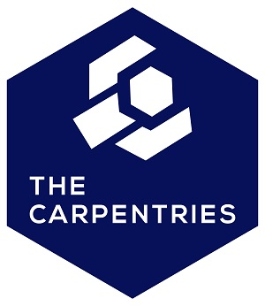

<style type="text/css">

body, td {
   font-size: 18px;
}
code.r{
  font-size: 14px;
}
pre {
  font-size: 14px
}
</style>

```{r, echo = FALSE}
htmltools::img(src = knitr::image_uri("images/ww_master_orange.png"), 
              alt = 'logo', 
              style = 'position:absolute; top:5; right:0; padding:10px; width:170px; height:120px')
```

*This is the course handbook for WolfWorks: An introduction to R.*

***

## General information  

This workshop is part of the WolfWorks academic skills development at Wolfson 
College, University of Cambridge. All data has been generated specifically for 
demonstration purposes and does not reflect real-life data.  
  
**Who:** This course is aimed at university students and other researchers. 
Attendees are not expected to have any previous experience with R. All tools 
will be introduced from the most basic level upward.  

**Where:** The Roger Needham Room, Wolfson College, University of Cambridge. 
Unfortunately, this workshop is only available for in-person attendees and cannot
be joined virtually.  

**When:** November 16th 2023  

**Contact**: Please e-mail Laura Jeffrey (lkj26@cam.ac.uk) or Charlotte Hutchings
(ch941@cam.ac.uk) for more details.  
\


**The Carpentries** 

```{r carpentries_image, out.width = "150px", echo = FALSE, warning = FALSE, fig.align = "right", out.extra = 'style = "float:right;padding:10px"'}

```

This workshop is designed and taught by Charlotte Hutchings, a certified 
Carpentries instructor and PhD student at Wolfson College. The [Carpentries project](https://carpentries.org/index.html) 
is a global community with a mission to teach data and coding skills and to 
promote efficient, open, and reproducible research in all fields.  
  
As this is a Carpentries-based workshop, all attendees are required to conform to
the [Carpentries code of conduct](https://docs.carpentries.org/topic_folders/policies/code-of-conduct.html). 
\

***

## Course outline and schedule  
The course will be divided into two sessions, one in the morning (9.30AM - 12PM)
and one in the afternoon (1.30PM - 4PM). Each session will cover several key 
topics. 

```{r, echo = FALSE}
tabl1 <- data.frame("Session" = c(rep(c("Morning"), times = 4), rep(c("Afternoon"), times = 2)),
                    "Topic" = c("An introduction to R and RStudio", 
                                "Objects in R", 
                                "Data structures in R",
                                "Starting with your own data",
                                "An introduction to the tidyverse",
                                "Data visualisation using ggplot"))

knitr::kable(tabl1, 
             col.names = c("Session", "Topic"),
             caption = "Outline of today's workshop")
```
\
