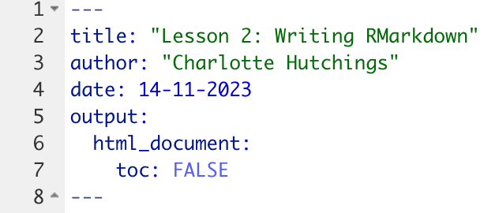
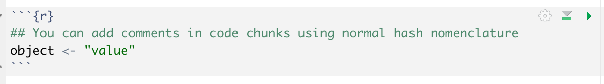
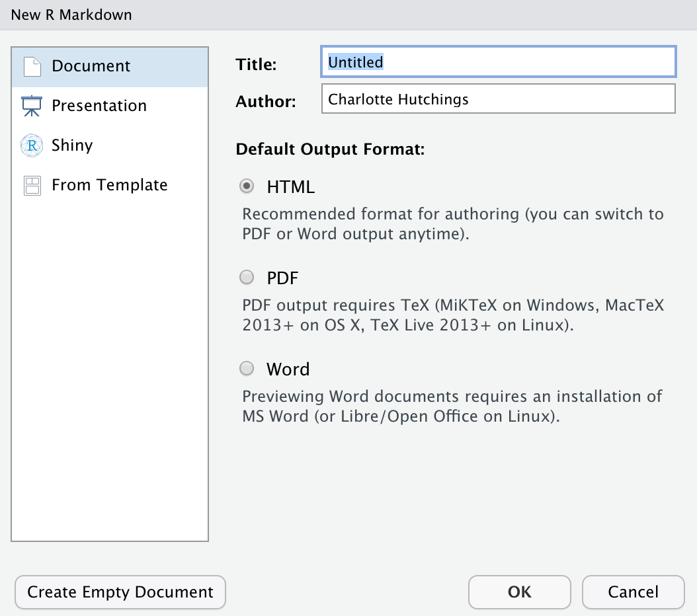
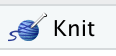
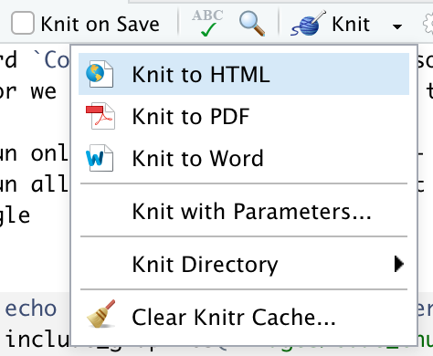
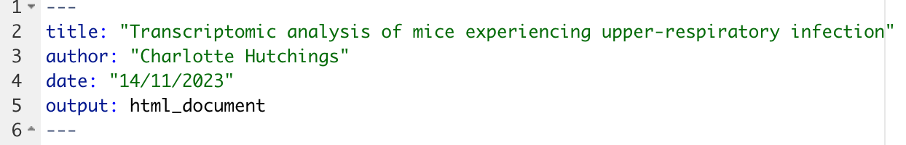
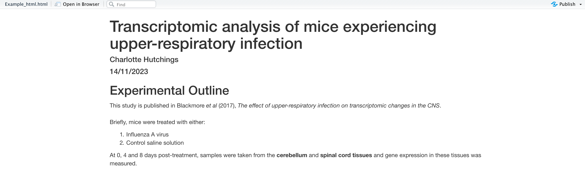
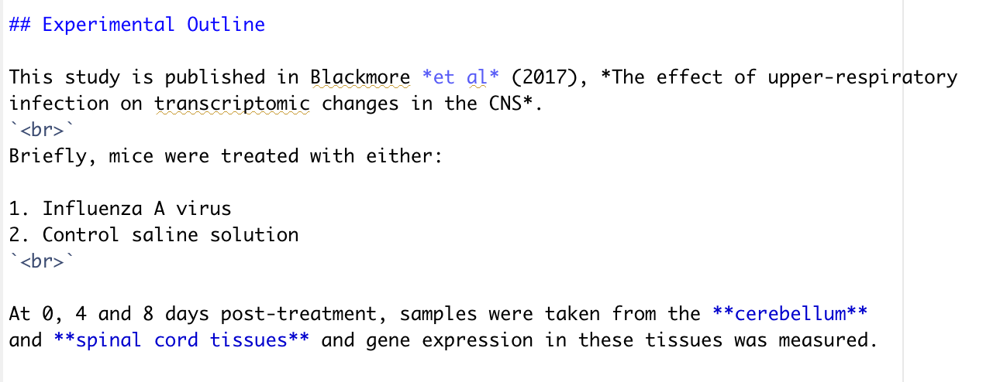

<style type="text/css">

body, td {
   font-size: 18px;
}
code.r{
  font-size: 14px;
}
pre {
  font-size: 14px
}
</style>

Objectives:

* Create an R Markdown file and be aware of its three main components: header, markdown and code chunks
* Be able to create and execute code chunks 
* Know the syntax for basic R Markdown: headings, text links, lists, text formating etc.
* Insert images and tables using `knitr`

***


## R Markdown files

The term R Markdown can be used to refer to two seperate concepts: (1) a file
type and (2) a writing style / language. 

The **R Markdown file** is a document which contains a mixture of text and code.
The document contains three key features - a header, some text (written in the
markdown language) and code chunks. This document can be _rendered_ into
various outputs including word documents, pdf files and websites. The final 
output will not only contain text and code, but also the resulting output of 
any executed code e.g., figures and tables. 

The **R Markdown language** refers to the specific way in which we can write 
and format text within an R Markdown document. We will cover key aspects of this
language throughout the workshop. 
<br>
<br>

### Header

The header of an R Markdown document is written in YAML format (another language, 
but this is not important). This section is optional but also very important 
in determining what the rendered output of an R Markdown file will look like.
For example, the header contains information such as the document title, author
and date. It is also the place where we can specify the document type to render
to (e.g., `.html`, `.pdf` or `.doc`) and whether we want any table of cotents in
the output. We will see several of these options throughout the course.
<br>

```{r, echo = FALSE, fig.align = "center", out.width = "60%"}

```
<br>
<br>

### Markdown

The Markdown refers to all text that is written in the main body of the R
Markdown document. Unlike when using R scripts, we do not have to use the `#`
operator to comment out our text. In R Markdown files, all text will be seen 
as text not code, only text within code chunks (see below) is treated as code.

Within the Markdown language there are additional ways to format text e.g., 
inclusion of headings and sub-headings, bullet point and numbered lists,
bold and italic fonts etc. We will come across how to achieve these style 
features throughout the workshop.
<br>
<br>

### Code chunks

The code chunks are where we can write code. To add a new code chunk we press
`Cmd + Option + i` on mac or `Cntrl + Alt + i` on Windows. A grey box appears
in which we can write code. Only code within chunks (not the text part of the
main document) can be executed. To execute a code chunk we can either use the
standard `Control + Enter` (you can also use `Cmd + Return` if you are using a
Mac), or we can use the buttons in the top right corner of the code chunk.

* To run only the selected code chunk - click the right-most green triangle
* To run all code chunks above (but not including) the selected code chunk - click the left grey triangle with green rectangle


```{r, echo = FALSE, fig.align = "center", out.width = "80%"}

```
<br>
<br>

**Challenge: Starting with R Markdown**
<br>
Create a new R Markdown document to later be rendered to a `.html` file. Give
this markdown the title: "Transcriptomic analysis of mice experiencing upper-
respiratory infection". Save this file in the `scripts` folder of your project
working directory.
<br>

<details>  
<summary>Solution</summary> 
<br>

To create a new R Markdown file we first navigate to `File -> New File -> R Markdown...`.
When we click this the following window should pop up.

```{r, echo = FALSE, fig.align = "center", out.width = "80%"}

```

In the top box we can assign the name of our document. This does not have to 
be the same as the title we will give it in the header of the R Markdown file.
You can call the document anything you like. 

To specify which type of output file we would like the document to generate we
make sure that the `HTML` box is selected. This does not mean that we are 
bound to this decision and can only render to `.html`, this is just the default
that will happen if we click the `knit` button at the top of the window. If we
later want to render the document to a `.pdf` or otherwise, these options still 
exist in the drop-down from `knit`.

```{r, echo = FALSE, fig.align = "left", out.width = "20%"}

```

```{r, echo = FALSE, fig.align = "left", out.width = "20%"}

```

Finally, we can add our title to the header at the top of our page.

```{r, echo = FALSE}

```


</details>
<br>

***

## Markdown syntax

The main body of text in an R Markdown file is written in Markdown syntax. There
are a lot of things that we can do with Markdown syntax, far more than can be
covered in this workshop. We will cover the key aspects of Markdown which you 
are most likely to want to use.
<br>
<br>

### Headings

For all forms of report, whether it be `.pdf` or a website, headings and
subheadings are essential for clear writing. In Markdown headings are created
using the `#` operator. The more `#` operators in a row, the smaller the 
heading appears in our rendered document.
<br>
<br>
`# Heading 1 - biggest` creates:

# Heading 1 - biggest
<br>

`## Heading 2 - still big` creates:

## Heading 2 - still big
<br>

`### Heading 3 - smaller` creates:

### Heading 3 - smaller
<br>

`#### Heading 4 - smallest` creates:

#### Heading 4 - smallest
<br>


### Inline text formating

To make text **bold** use `**double asterisks**` or `**__double underscores__**`  
To make test italic use `*single asterisks*` or `_single underscore_`  
To make text ^superscript^ use `^caret^`  
To make test ~subscript~ use `~tilde~`
To format text to look like code use ``backticks``
<br>
<br>

### Line breaks

To create a line break, put two or more spaces at the end of a sentence before 
pressing `enter`. This will ensure that the text starts on a new line. If you 
want an additional blank line before the next text, then use the `<br>` syntax
on the line you wish to be empty and press `enter` again.

`some writing`
<br>
`<br>`
<br>
`some more writing.`
<br>

This will render as:
<br>

Some writing.  
<br>
Some more writing.
<br>
<br>

Another option is to start a new line and use three asterisks (`***`) to insert
a divider.
<br>
<br>

### Lists - bulluted and numbered

To create an unordered list we can use a single asterisk (`*`) to denote each 
point:

* Item 1
* Item 2 
* Item 3
<br>

To create an ordered list we can use numbers to denote each point:

1. Item 1
2. Item 2
3. Item 3
<br>

We can also create subpoints in both types of list by using the `+` operator:

1. Item 1
    + Item 1a
    + Item 1b
2. Item 2
3. Item 3
<br>
<br>

**Challenge: Using R Markdown syntax**  
Create a `.html` file that look like this: 

```{r, echo = FALSE, fig.align = "center", out.width = "100%"}

```
<br>

<details>  
<summary>Solution</summary> 
<br>
In R Markdown this would look like: 

```{r, echo = FALSE}

```


</details>
<br>
<br>

There are still lots more things that we can do in R Markdown.

***

## Tables in R Markdown

There are several ways in which we can create a table in R Markdown. 

#### Using standard markdown syntax
The first way is to use the `|` and `-` operators to create table.  
<br>

```{r, eval = FALSE}
| Column 1 | Column 2 |
| -------- | ---------|
| Data 1a  | Data 2a  |
| Data 1b  | Data 2b  |
```

<br> 
This is rendered as:
<br>

| Column 1 | Column 2 |
| -------- | ---------|
| Data 1a  | Data 2a  |
| Data 1b  | Data 2b  |
<br>

To make the table look neater we can align the columns using the following 
syntax:

```{r, eval = FALSE}
| Left align | Center align | Right align |
| :--------- | :----------: | ----------: |
| Data 1a    | Data 2a      | Data 3a     |
| Data 1b    | Data 2b      | Data 3b     |
```

Now the table is rendered as:
<br>

| Left align | Center align | Right align |
| :--------- | :----------: | ----------: |
| Data 1a    | Data 2a      | Data 3a     |
| Data 1b    | Data 2b      | Data 3b     |

<br>

#### Using `knitr`

The `knitr` package within R hosts functions that can help us produce aesthetic
and dynamic reports. The package contains a function called `kable` which allows
for simple knitting of a table from a standard R `data.frame` structure. 
<br>

We create a `data.frame` first and assign it to an object.

```{r}
table <- data.frame("Column 1" = c("Data 1a", "Data 1b"),
                    "Column 2" = c("Data 2a", "Data 2b"))
```

When we execute this code (which is also done automatically when we knit the
document) a `data.frame` object is created in our RStudio environment. We can
pass this object to the `kable` function.

```{r}
knitr::kable(table,
             col.names = c("Column 1", "Column 2"),
             caption = "Creating a table with knitr::kable()")
```
<br>

This second approach is particularly useful if the table that you wish to render
is based on data that you are working with.
<br>

***

## Images in R Markdown

As with tables, there are several ways in which we can add images into our
final rendered document.


#### Using standard markdown syntax

Again, we can use a standard markdown syntax. To insert an image this looks like
``.
<br>

For example, `` will be
rendered as:
<br>


<br>

#### Using `knitr`

We can also use another `knitr` function called `include_graphics`.

```{r}
knitr::include_graphics("images/Rlogo.png")
```

<br>

This second method has the advantage of being more flexible and providing easier
routes to change the image formating e.g., size, alignment, caption. We will 
come across some of these later.
<br>

**Challenge: Adding tables and images using `knitr`**  

Add to your previous `.html` document to create the following `.html`.
<br>

```{r, echo = FALSE, fig.align = "center", out.width = "100%"}
knitr::include_graphics("images/html_challenge_2.png")
```

<details>  
<summary>Hint</summary> 
<br>

There are various ways to change the size, alignment and caption of a rendered
image using `knitr`. We can include these instructions in the **chunk options**, 
which we put inside of the `{}` at the top of the code chunk. Try to use the
arguments `fig.align` and `out.width`.

</details>

<details>  
<summary>Solution</summary> 
<br>

In R Markdown this would look like: 

```{r, echo = FALSE}
knitr::include_graphics("images/html_solution_2.png")
```
<br>
