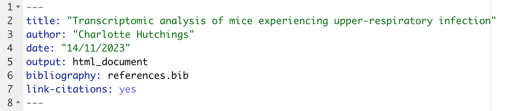
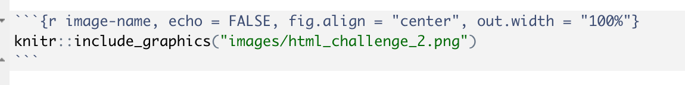

<style type="text/css">

body, td {
   font-size: 18px;
}
code.r{
  font-size: 14px;
}
pre {
  font-size: 14px
}
</style>

Objectives:

* Know how to add references to an R Markdown document, both external and references to tables/figures within the document
* Add website links to an R Markdown document
* Be aware of different chunk labels and options: `include`, `echo`, `message`, `warning`, `fig.width`, `fig.height`, `fig.align`
* Convert R notebooks into `pdf`, `htlm` or word `doc` files

***

## Adding references in R Markdown

When using R Markdown to create academic documents, whether these be analysis
or reports, it is common to want to include references.
<br>

#### External references
To do this you need to create a separate bibliography file (`.bib`) that contains
all of the required references in a BibTeX format.

<br>
<br>

Many referencing management tools will allow references to be exported in a BibTeX
format. However, if you are struggling to access these, you can use websites
such as [doi2bib](https://www.doi2bib.org) to generate BibTeX references from a
doi, PMCID, or ArXiv ID.

<br>
<br>

Once we have a `.bib` file saved in our working directory, we add the file path
to our R Markdown header under `bibliography: reference_file_name.bib`. Items
can then be referenced within the R Markdown document using the `@key` syntax,
where the key is given in the BibTeX database. To put citations in parentheses, 
use [@key]. To cite multiple entries, separate the keys by semicolons, e.g., 
[@key-1; @key-2; @key-3]. To create a link from the in-text citation to the 
corresponding reference in the bibliography, we add `link-citations: yes` to 
our header.
<br>
<br>

The default referencing style is Chicago author-date format. To change the 
referencing style we add another argument to our header with a link to a CSL
(Citation Style Language) file. The CSL files for most major referencing styles
can be found at the [Zotero Style Repository](https://www.zotero.org/styles).
<br>
<br>

**Challenge: Adding references using a `.bib` file**  
<br>
Go to [Blackmore et al., 2017](https://www.ncbi.nlm.nih.gov/pmc/articles/PMC5544260/)
add use the paper doi to generate a BibTeX format reference. Save this in a `.bib`
file (can be done from a standard text editor) and create a link to this file in
your R Markdown header. Use the `@key` syntax to add this in-text citation with 
a link to the bibliography.
<br>

<details>  
<summary>Solution</summary> 
<br>

To create the BibTeX reference, simply copy and paste the doi at [doi2bib](https://www.doi2bib.org).
Open a plain text file and copy the resulting reference in. Save this file with 
a `.bib` extension in the project working directory. To the header, add:
<br>

```{r, echo = FALSE}

```
<br>
Add `[@Blackmore2017]` to include the in-text citation.

</details>
<br>


#### References figures and tables generated in code chunks

We saw in the last lesson that tables and images can be added to an R Markdown
document using the `knitr` functions `kable` and `include_graphics`. It is also
possible to make reference to these tables and figures in the Markdown text. To 
do so:

1. Include a name in the chunk label - add next to `r` in the code chunk
2. Add in-text citation using the syntax `\@ref(fig:r_chunk_name)` or `\@ref(tab:r_chunk_name)`
<br>
<br>

```{r, echo = FALSE, out.width = "50%"}

```
<br>
The above image could be referenced by typing "... as show in Figure `\@ref(fig:image-name)`.
You don't need to keep track of which number each figure/table is, R does this 
for you.
<br>

**Important:** To use this syntax, we need to have out output set to an updated
`.html` format. Change the header to `output: bookdown::html_document2`.
<br>
<br>

#### Adding links to web pages

To add an external link to a webpage we can use `[]()` syntax. Inside the first
set of square brackets type the text which you wish to be rendered in Markdown
with the link, and then add the link itself into the second brackets. For 
example `[click here](https://www.wolfson.cam.ac.uk)` would render as:
<br>

[click here](https://www.wolfson.cam.ac.uk)
<br>

***

## Code chunk options

